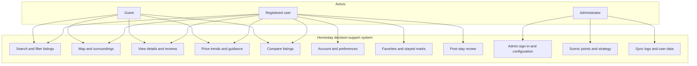

# Chapter 2 — System Requirements Analysis (Draft)

---

## 2. System Requirements Analysis

### 2.1 Stakeholder Identification

The system supports browsing short-term and homestay-style listings and helps travellers make decisions. There are three main stakeholder groups.

#### 2.1.1 Guest

Guests are users who are not signed in or who continue as a guest. They mainly need to view the home page, complete a short preference onboarding, search listings with filters, see locations and surroundings on a map, open listing details and price trends, and add several listings to a comparison list. Guests can follow the core browsing journey; features that depend more strongly on a personal account (such as long-term saved preferences or synced favorites) are primarily aimed at registered users.

#### 2.1.2 Registered User

Registered users have signed up and signed in. In addition to everything a guest can do, they can maintain a profile, save preference tags from onboarding, manage favorites and “stayed here” records, and write post-stay reviews for listings they have marked as stayed, which gives a fuller personalised experience.

#### 2.1.3 Administrator

Administrators are a single role responsible for back-office operations and configuration. After signing in, they can maintain scenic-point information, adjust weights and default preferences in the recommendation strategy, view or record data-sync related logs, and when needed inspect basic user-side data so that content and strategy stay aligned with operational goals.

---

### 2.2 Functional Requirements

The following describes the main requirements by functional area, for alignment with product design and implementation.

#### 2.2.1 Listing Search and Filtering

The system shall support combined filters such as price, number of guests, bedrooms and bathrooms, room type, and amenities; keyword search; and paginated list browsing. The map may work together with the list so that, as the user pans or zooms the map, the list shows only listings in the current map view. Filtering by vibe-style tags shall be supported, including either “match any” or “match all” when several tags are selected.

#### 2.2.2 Intelligent Recommendation

On top of search results, the system shall be able to rank or score listings using factors users care about (for example distance to points of interest, price level, sentiment or scores from past reviews, and user- or system-defined preference tags) so that suitable options are easier to find. Administrators shall be able to change the relative weights of these factors so that recommendation behaviour matches operational priorities.

#### 2.2.3 Price Forecasting

For each listing, the system shall show trend charts for monthly price or occupancy-style indicators where available, to help users see rough price variation or busy periods, together with short booking guidance. When data are sparse, the interface shall remain clear and avoid empty or misleading presentations.

#### 2.2.4 User Account and Preference Management

The system shall provide registration, sign-in, and profile maintenance; during onboarding it shall capture user preferences for vibe tags and allow them to be stored and retrieved. Users shall manage a favorites list and may mark a listing as “stayed,” which supports later reviews.

#### 2.2.5 Property Comparison

Users shall add several listings to a comparison list and view them side by side on a dedicated page using charts or tables (e.g. price, ratings, room layout) to support a final choice. The comparison view should gradually align with real listing fields; early versions may use partly illustrative content to validate the interaction design.

#### 2.2.6 Post-Stay Review System

Reviews shall only be allowed for listings the user has marked as stayed; the same user shall not submit more than one review for the same listing. A review may include multi-dimensional scores and free text, and shall be clearly distinct in meaning from public historical reviews shown on the detail page that come from the dataset.

#### 2.2.7 Admin Configuration and Monitoring

The admin area shall support administrator authentication; CRUD and listing of scenic points; viewing and saving recommendation strategy settings (weights and default preferences, etc.); viewing and recording sync or maintenance logs; and optionally a way to browse user data for operations and support.

---

### 2.3 Use Case Diagrams

The diagrams below use Mermaid syntax and can be rendered in any editor or export pipeline that supports Mermaid.

#### 2.3.1 System context (guest, registered user, administrator)



#### 2.3.2 Guest vs registered user (emphasis on differences)

```mermaid
usecaseDiagram
  actor Visitor as Guest
  actor User as Registered user
  package Shared {
    usecase UC_Search as Search and filter listings
    usecase UC_Map as Use map and surroundings
    usecase UC_Detail as View listing details
    usecase UC_Forecast as View price trends
    usecase UC_Compare as Compare several listings
  }
  package Account {
    usecase UC_Reg as Register and sign in
    usecase UC_Pref as Save and use preferences
    usecase UC_Fav as Manage favorites
    usecase UC_Stay as Mark listing as stayed
    usecase UC_Rev as Submit post-stay review
  }
  Visitor --> UC_Search
  Visitor --> UC_Map
  Visitor --> UC_Detail
  Visitor --> UC_Forecast
  Visitor --> UC_Compare
  User --> UC_Search
  User --> UC_Map
  User --> UC_Detail
  User --> UC_Forecast
  User --> UC_Compare
  User --> UC_Reg
  User --> UC_Pref
  User --> UC_Fav
  User --> UC_Stay
  User --> UC_Rev
```

#### 2.3.3 Administrator use cases

```mermaid
usecaseDiagram
  actor Admin as Administrator
  usecase UC_Login as Administrator sign-in
  usecase UC_Scenic as Maintain scenic points
  usecase UC_Strategy as Configure recommendation strategy
  usecase UC_Sync as View sync logs
  usecase UC_UserData as View user data
  Admin --> UC_Login
  UC_Scenic ..> UC_Login : <<include>>
  UC_Strategy ..> UC_Login : <<include>>
  UC_Sync ..> UC_Login : <<include>>
  UC_UserData ..> UC_Login : <<include>>
  Admin --> UC_Scenic
  Admin --> UC_Strategy
  Admin --> UC_Sync
  Admin --> UC_UserData
```

---

## Revision history

| Date | Note |
|------|------|
| 2026-04-18 | First draft (Chinese) |
| 2026-04-18 | Simplified stakeholders and functional text; shortened then removed non-functional section |
| 2026-04-18 | Translated to English; removed §2.3 non-functional requirements; former use case section renumbered to §2.3 |
