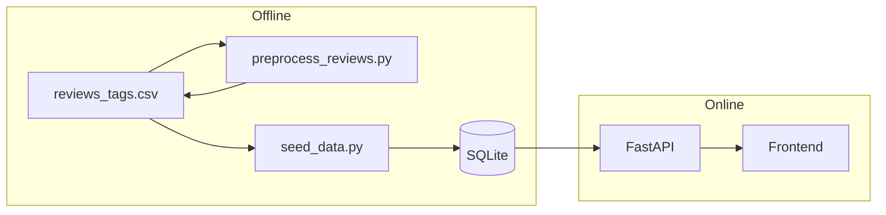

# Review Sentiment Classification (English)

This document describes how **per-review sentiment** (three-way classification) and **listing-level sentiment aggregates** work in this repository. Vibe-style tags (`vibe_tags`, `vibe_tags_detail`) are supplied by upstream CSVs and are **not** produced by this pipeline.

---

## 1. Scope

| Item | Description |
|------|-------------|
| **What is classified** | Each review’s `review_text_cleaned` (cleaned English body) |
| **Output label** | `sentiment_label`: `Positive`, `Neutral`, or `Negative` (stable contract for API and UI) |
| **Out of scope** | `vibe_tags_detail`, listing-level `vibe_tags`, and other topic/vibe taxonomies |

---

## 2. End-to-end data flow



1. **`preprocess_reviews.py`** reads `Data/reviews_tags.csv`, runs the model on non-empty bodies, and writes `sentiment_label` back into the same CSV.  
2. **`seed_data.py`** reads that CSV again, inserts rows into the `reviews` table, and **overwrites** selected sentiment columns on `listings` using an aggregation over reviews (Section 5).  
3. The **HTTP API** only reads stored `sentiment_label` values and listing aggregates; it **does not** run the transformer at request time.

---

## 3. Per-review model: RoBERTa three-way classifier

### 3.1 Model and dependencies

- **Code**: `backend/preprocess_reviews.py`  
- **Model ID**: `cardiffnlp/twitter-roberta-base-sentiment-latest` (Hugging Face)  
- **Architecture**: RoBERTa-based **sequence classification** into three labels (negative, neutral, positive), trained on social-style English. It generally handles nuance, colloquial phrasing, and longer passages better than lexicon-only methods (for example VADER).  
- **Dependencies**: `torch`, `transformers`. The first run downloads model weights from Hugging Face (on the order of hundreds of MB).

### 3.2 Inference steps (what happens to each scored review inside a batch)

For every review that is actually scored, the logic is equivalent to:

1. **Tokenization**  
   `AutoTokenizer` converts the string to token IDs with RoBERTa-specific specials.  
   Important kwargs: `padding=True` (pad within the batch), `truncation=True`, `max_length=512`. Text longer than 512 tokens is **truncated**; only the leading span influences the prediction.

2. **Forward pass**  
   `AutoModelForSequenceClassification` consumes the batch under `torch.inference_mode()` (no gradients).  
   Each sample yields a **3-dimensional logit vector**, one score per class.

3. **Decision rule: argmax**  
   The predicted class id is `argmax` over the class dimension. There is **no** temperature scaling, calibrated thresholding, or model ensembling: the highest logit wins.

4. **Mapping to application strings**  
   The model’s `id2label` maps the integer id to Hugging Face label strings (for example `negative`, `neutral`, `positive`).  
   `_canonical_sentiment` normalizes these to **`Positive` / `Neutral` / `Negative`**, including fallbacks for names like `LABEL_0` / `LABEL_1` / `LABEL_2` when present in config.

5. **Batching**  
   Multiple reviews are encoded and scored together (default `batch_size=16`, overridable via `--batch-size`) on `cuda` or `cpu` (`--device auto|cpu|cuda`).

### 3.3 Rows that skip the neural model

The script **does not** call RoBERTa and instead sets `sentiment_label` to **`Neutral`** when:

- `review_text_cleaned` is missing (`NaN` in pandas), or  
- After `strip()`, the string is **empty**.

Therefore the total CSV row count can exceed the progress counter `y` in log lines `RoBERTa … x/y`: `y` is only the count of non-empty bodies sent through the model.

---

## 4. CLI summary

From the `backend` directory:

```text
python preprocess_reviews.py [--batch-size N] [--device auto|cpu|cuda]
```

Output is written back to **`Data/reviews_tags.csv`**. Other columns (including `vibe_tags_detail`) are left unchanged except for `sentiment_label`.

---

## 5. Listing-level aggregation in `seed_data.py`

### 5.1 Rationale

Fields such as `average_sentiment_score` and sentiment counts/ratios might still reflect older logic if they came only from `listings_intelligent_profile.csv`. To stay consistent with **current** per-review RoBERTa labels, the seeder recomputes these fields from the same `reviews_tags.csv` used to populate `reviews`, and **writes** the result onto each listing row before inserting into SQLite.

### 5.2 Where and when

- **Function**: `_apply_listing_sentiment_from_reviews` in `backend/seed_data.py`  
- **When**: After building `df_listings` from listings + profile merge, **before** `to_sql("listings", …)`. The script reads `reviews_tags.csv` into `rev`, updates `df_listings`, then persists listings.

### 5.3 How a single review is counted as positive / neutral / negative

After normalizing `sentiment_label` as text:

- **`Positive`** → positive bucket  
- **`Negative`** → negative bucket  
- **Everything else** (including `Neutral`, empty string, or unexpected values) → **neutral** bucket for aggregation

So “neutral” in aggregates also acts as a catch-all for non-explicit positive/negative labels.

### 5.4 Per-`listing_id` formulas

For each `listing_id` present in the reviews CSV, let \(n\) be the number of review rows, with counts \(c_+\), \(c_0\), \(c_-\) for positive, neutral (catch-all), and negative as above, so \(n = c_+ + c_0 + c_-\):

- **`sentiment_positive_count`** = \(c_+\)  
- **`sentiment_neutral_count`** = \(c_0\)  
- **`sentiment_negative_count`** = \(c_-\)  
- **`sentiment_positive_ratio`** = \(c_+ / n\) (and analogously for neutral and negative)  
- **`average_sentiment_score`** = \(\dfrac{1.0 \cdot c_+ + 0.5 \cdot c_0 + 0.0 \cdot c_-}{n}\)

That is: map positive to 1, neutral to 0.5, negative to 0, then take the **arithmetic mean** over all reviews for the listing. The score lies in **[0, 1]**, matching the frontend convention of displaying it as a percentage-like value.

### 5.5 Interaction with the profile CSV

- If a listing has **at least one** review row in the CSV, the seven sentiment fields above **replace** the merged profile values for that listing.  
- If a listing has **no** review rows in the CSV, the seeder **keeps** the sentiment fields coming from `listings_intelligent_profile.csv` (subject to the generic NA-filling helpers used elsewhere in `seed_data.py`).

---

## 6. Limitations and caveats

- **Language**: The model is English-centric; quality on other languages is not guaranteed.  
- **Long reviews**: Content beyond 512 tokens is ignored for classification.  
- **Empty bodies**: Forced to `Neutral`, which affects listing averages and ratios; interpret that at the data-cleaning layer if needed.  
- **Single argmax**: Sarcasm, strong mixed polarity, or domain-specific jargon can still be misclassified; better behavior may require aspect-based models, human labels, or fine-tuning.

---

## 7. File index

| Path | Role |
|------|------|
| `backend/preprocess_reviews.py` | Offline RoBERTa inference; writes `sentiment_label` |
| `backend/seed_data.py` | Loads CSV, aggregates listing sentiment, writes `reviews` / `listings` |
| `Data/reviews_tags.csv` | Offline source of truth for reviews and `sentiment_label` |
| `backend/models.py` | ORM: `Review.sentiment_label` and listing sentiment columns |
| `frontend/src/pages/PropertyDetails.jsx` | UI charts and per-review display from API payloads |

---

*Keep this document in sync if you change formulas in `preprocess_reviews.py` or `_apply_listing_sentiment_from_reviews`.*
