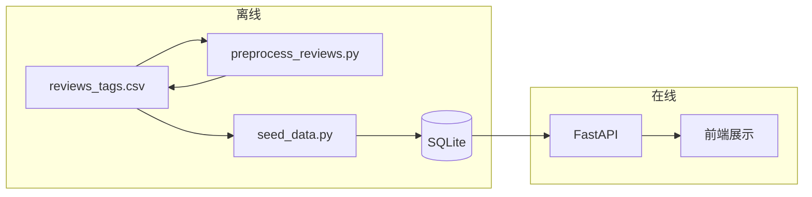

# 评论情感分类算法说明（中文版）

本文说明本仓库中**评论级情感三分类**及**房源级情感汇总**的机制与数据流。氛围类标签（`vibe_tags`、`vibe_tags_detail`）由上游 CSV 提供，**不在此流水线中计算**，本文不展开。

---

## 1. 总体范围

| 项目 | 说明 |
|------|------|
| **分类对象** | 每条评论的 `review_text_cleaned`（清洗后的英文评论正文） |
| **输出标签** | `sentiment_label`：`Positive`、`Neutral`、`Negative`（与 API / 前端约定一致） |
| **不负责的部分** | `vibe_tags_detail`、房源 `vibe_tags` 等氛围/主题标签 |

---

## 2. 端到端数据流



1. **`preprocess_reviews.py`**：读取 `Data/reviews_tags.csv`，对非空正文跑模型，写回同一文件中的 `sentiment_label` 列。  
2. **`seed_data.py`**：再次读取该 CSV，将评论写入 `reviews` 表，并根据评论标签**覆盖**部分房源在 `listings` 表中的情感统计字段（见第 5 节）。  
3. **后端 API** 只读取数据库中已存好的 `sentiment_label` 与房源汇总字段，**不在请求路径上调用大模型**。

---

## 3. 单条评论：RoBERTa 三分类模型

### 3.1 模型与依赖

- **实现位置**：`backend/preprocess_reviews.py`  
- **模型 ID**：`cardiffnlp/twitter-roberta-base-sentiment-latest`（Hugging Face）  
- **类型**：基于 RoBERTa 的**序列分类**（3 类：negative / neutral / positive），在社交媒体式英文文本上训练，比传统词典方法（如 VADER）更能处理转折、口语和长句。  
- **运行时依赖**：`torch`、`transformers`；首次运行会从 Hugging Face 拉取权重（体积约数百 MB）。

### 3.2 推理流程（单条评论在批内的实际步骤）

对每一条**需要打分的**评论文本，逻辑等价于以下步骤：

1. **分词与编码**  
   使用与模型配套的 `AutoTokenizer`，将字符串转为 token id，并加入 RoBERTa 所需的特殊符号。  
   参数要点：`padding=True`（同一批内对齐长度）、`truncation=True`、`max_length=512`。超过 512 个 token 的尾部会被截断，超长评论只根据前段内容分类。

2. **前向传播**  
   `AutoModelForSequenceClassification` 接收编码后的张量，在 `torch.inference_mode()` 下推理（不更新梯度）。  
   模型对每个样本输出 **3 维 logits**，分别对应三个情感类别。

3. **决策规则：argmax**  
   对 logits 在类别维上取 **argmax**，得到整数类别 id（0、1 或 2）。  
   **不做**温度缩放、阈值校准或集成；即「分数最高的那一类」为最终类别。

4. **标签映射到业务字符串**  
   使用模型配置中的 `id2label`，将 id 映射为 Hugging Face 侧的标签名（如 `negative`、`neutral`、`positive`）。  
   再通过 `_canonical_sentiment` 统一为 **`Positive` / `Neutral` / `Negative`**。若配置中出现 `LABEL_0` 等形式，也会映射到负/中/正三类之一。

5. **批处理**  
   多条评论组成一批（默认 `batch_size=16`，可用命令行 `--batch-size` 修改），在 GPU 或 CPU 上批量编码与推理，以缩短总耗时。  
   设备：`--device auto`（有 CUDA 则用 GPU，否则 CPU）、`cpu` 或 `cuda`。

### 3.3 不经过模型的行（规则写死）

以下情况**不会**调用 RoBERTa，直接将 `sentiment_label` 设为 **`Neutral`**：

- `review_text_cleaned` 为缺失值（如 CSV 中的空单元格 / NaN）；  
- 去掉首尾空白后**长度为 0** 的字符串。

因此全表行数可能大于日志里「RoBERTa … x/y」中的 `y`：`y` 仅为非空评论条数。

---

## 4. 命令行入口小结

在 `backend` 目录下：

```text
python preprocess_reviews.py [--batch-size N] [--device auto|cpu|cuda]
```

输出仍写回 **`Data/reviews_tags.csv`**，其它列（含 `vibe_tags_detail`）保持不变，仅更新或填充 `sentiment_label`。

---

## 5. 房源级汇总：`seed_data.py` 中的对齐逻辑

### 5.1 目的

列表页、排序等使用的 `average_sentiment_score`、正负中性 **count / ratio** 若只来自旧的 `listings_intelligent_profile.csv`，可能与**当前**逐条评论的 RoBERTa 标签不一致。因此在灌库时用评论表（此处为**同一份** `reviews_tags.csv`）对房源做一次聚合，**覆盖**房源上的情感统计字段。

### 5.2 实现位置与时机

- **函数**：`seed_data.py` 中的 `_apply_listing_sentiment_from_reviews`  
- **调用时机**：在 `listings` 写入 SQLite **之前**；`seed_data.py` 会先读取 `reviews_tags.csv` 得到 `rev`，对 `df_listings` 做合并更新，再 `to_sql("listings", …)`。

### 5.3 单条评论如何计入「正 / 负 / 中」

在聚合时，对 `sentiment_label` 做字符串规范化后：

- 等于 **`Positive`** → 计入正面；  
- 等于 **`Negative`** → 计入负面；  
- **其余任意取值**（含 `Neutral`、空字符串、未知拼写）→ 计入中性。

因此中性类在统计上承担「非明确正/负」的兜底含义。

### 5.4 按 `listing_id` 聚合的公式

对每个在评论 CSV 中出现过的 `listing_id`，设该房源评论总数为 \(n\)，正、中、负条数为 \(c_+, c_0, c_-\)（由上文规则得到，且 \(n = c_+ + c_0 + c_-\)）：

- **`sentiment_positive_count`** = \(c_+\)  
- **`sentiment_neutral_count`** = \(c_0\)  
- **`sentiment_negative_count`** = \(c_-\)  
- **`sentiment_positive_ratio`** = \(c_+ / n\)（同理中性、负面比例）  
- **`average_sentiment_score`** = \(\dfrac{1.0 \cdot c_+ + 0.5 \cdot c_0 + 0.0 \cdot c_-}{n}\)

即：正面记 1 分，中性记 0.5 分，负面记 0 分，再对**该房源全部评论**取算术平均。结果落在 **\[0, 1\]**，与前端将「情感分」按百分比展示的约定一致。

### 5.5 与 profile CSV 的关系

- 若某 `listing_id` 在评论 CSV 中**至少有一条**有效关联行，则上述七个字段以聚合结果**覆盖**该行房源在合并表中已有的情感字段。  
- 若某房源在评论 CSV 中**没有任何行**，则**保留**来自 `listings_intelligent_profile.csv` 合并后的原值（若上游为空，则仍由 `_fill_na_for_sql` 等逻辑处理）。

---

## 6. 局限与使用注意

- **语言**：模型面向英文；非英文或混杂语言评论质量不保证。  
- **长文**：超过 512 token 的部分不参与分类。  
- **空评论**：一律记为 Neutral，会拉低房源平均分或改变比例，需从数据清洗侧理解其含义。  
- **单一 argmax**：边界样本、讽刺、强烈混合情感仍可能整体被判为一类；若要更高阶行为需多模型、方面级情感或人工标注再训练。

---

## 7. 相关文件索引

| 文件 | 作用 |
|------|------|
| `backend/preprocess_reviews.py` | 离线 RoBERTa 推理，写 `sentiment_label` |
| `backend/seed_data.py` | 读 CSV、聚合房源情感、写入 `reviews` / `listings` |
| `Data/reviews_tags.csv` | 评论与 `sentiment_label` 的权威离线存储 |
| `backend/models.py` | `Review.sentiment_label` 与 `Listing` 情感字段的 ORM 定义 |
| `frontend/src/pages/PropertyDetails.jsx` | 按条展示与图表汇总（读取 API 返回的标签） |

---

*文档版本与实现保持一致；若修改 `preprocess_reviews.py` 或 `_apply_listing_sentiment_from_reviews` 中的公式，请同步更新本文。*
